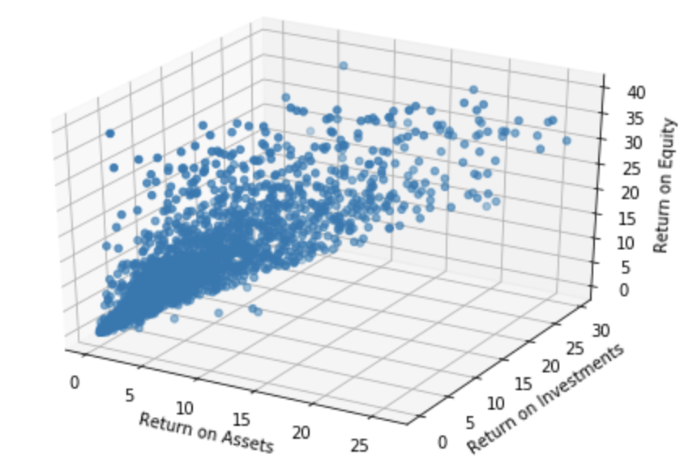
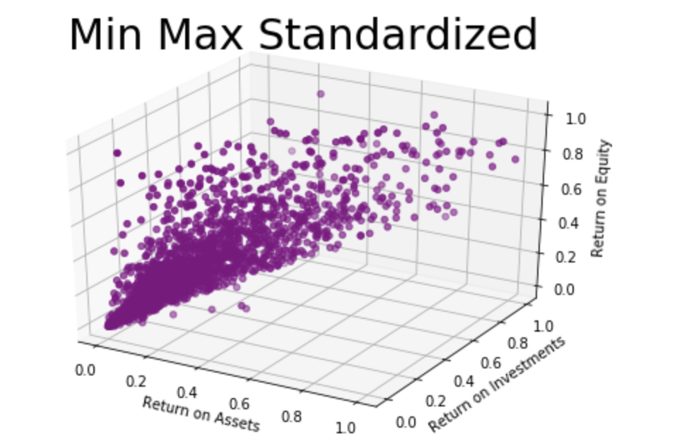
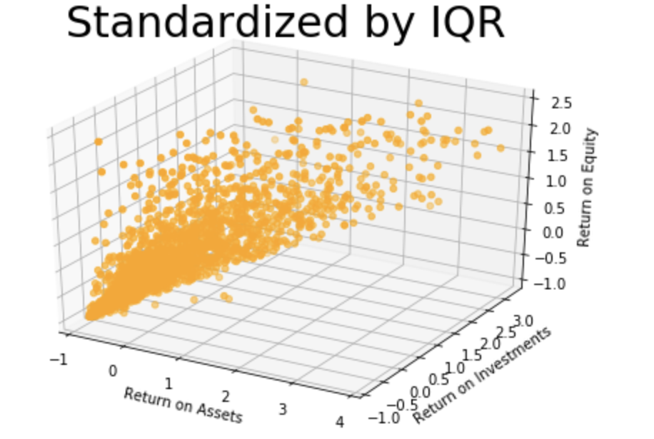
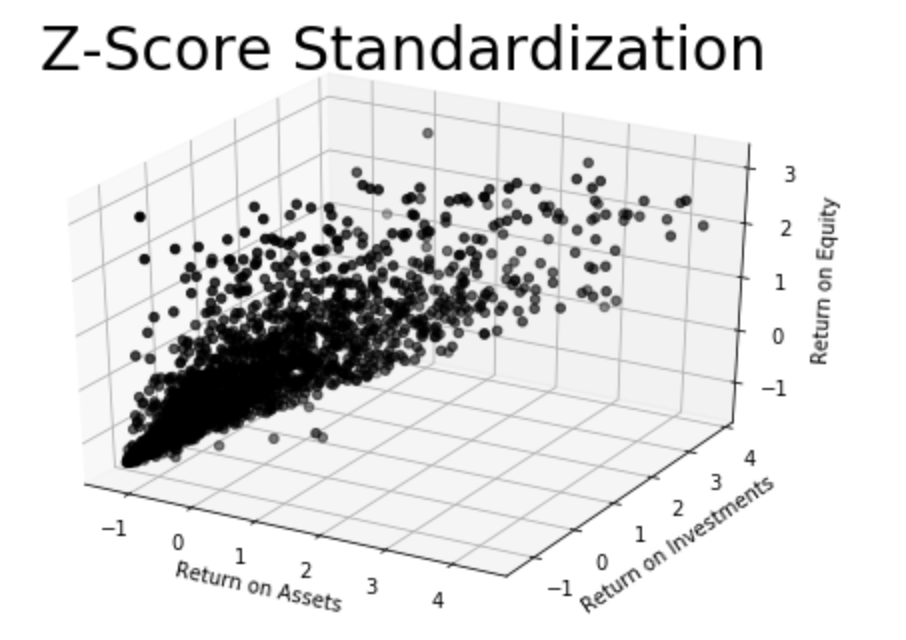
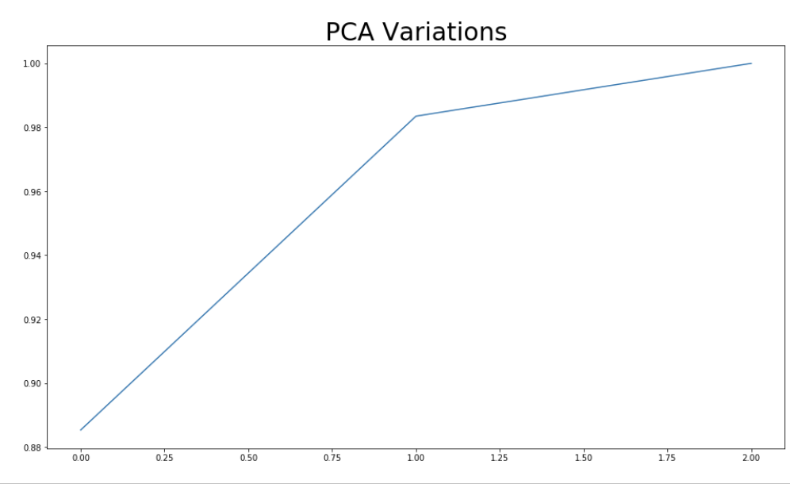

# Clustering Stocks with K-Means Algorithm

## Basic Overview:

* **Goal**: Create an algorithm that helps financial experts to categorize stocks with particular attributes in a specific cluster.

* Stock selection, outlier detection, portfolio creation are important mechanisms for the financial industry to maximize and strategize the right investments in the stock market. Therefore, using certain indicators (often latent factors) we would attempt to cluster the given stocks to enable data driven decision making.

* Clustering will help in pointing common attributes/characteristics the clustered stocks share.

## Why K-Means clustering?

* K-Means is one of the easiest clustering algorithm to understand. The understanding behind the algorithm also enabled me to find right methods to clean & prepare the data along with selecting the right hyperparamaneter for the algorithm.

* This understanding of the algorithm ensures that K-Means will be optimized in the right way to find structure in this unstructured stocks data.

* K-Means will ensure minimum distance between the data points and the K-centroids.

## Resources and code used:

* ***Python Version***: 3.8
* ***Packages***: Pandas, Matplotlib, Axes3D from mpl_toolkits, Numpy, Normalizing tools (MinMaxScaler, RobustScaler, StandardScaler), Sklearn (PCA, KMeans, Metrics)
* ***Data Source***: TD AmeriTrade (https://www.tdameritrade.com/api.page)
* ***Stock Domain Knowledge 101***: [Source 1](https://www.researchgate.net/publication/4885243_Stock_selection_based_on_cluster_analysis), [Source 2](http://people.stern.nyu.edu/adamodar/New_Home_Page/data.html)
* ***YouTube***: [Source 1](https://www.youtube.com/c/SigmaCoding/videos), [Source2](https://www.youtube.com/watch?v=EItlUEPCIzM)

## Data Acquisition:

* Accesed the TD AmeriTrade API to request stock data
* Used 'request' library to enable API data acquisition
* Original data consists of about 5.2K rows and 46 columns

## Data Cleaning:

  ### Attribute Selection:
    
    * Using multiple combinations of attributes and domain knowledge research, 3 attributes jumped out as consequential attributes in stock placements.
    * Major attributes: Return-On-Equirty (Financial Performance/Net Income), Return-On-Investment (Indicates the efficieny of the investment) and Return-On-Assets (indicates a respective company's profitability compared to its total assets)
    
  ### Data Preperation:
    
    * We remove all the NULL values because K-Means does not deal well with NULL values or 0 values.
    * Using the domain knowledge of stocks through papers published by NYU we determine the farthest maximum values that attributes of data is expected to be under. Anything over this maximum value is automatically discarded.
    * We use the above method rid the dataset of outliers.

## Visualization:

* Plotting our newly cleaned data we notice the following visualizations:

* We decided to use 3 standardization methods to devoid any of the attributes from distorting the clusters.
* Methods to standardize: Z-Score Standardization, Min-Max-Standardization and Inter-Quartile-Range (IQR) Standardization.
* The following are the plots of such standardizations:

* Looking at the visualizations and scales it was decided to go for IQR standardized dataset

## Exploring PCA:

* PCA was explored to help model building gain speed.
* PCA was a choice to explore dimensionality reduction because of its strength to lower the weight of the data without losing any significant meaning.
* We discovered 2 components were able to give us almost 100% of variation in the data:

